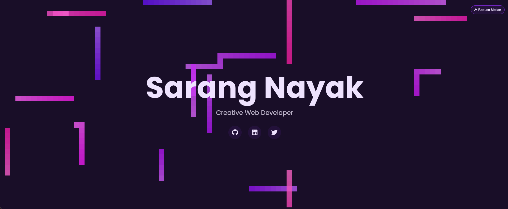

# hero-section-type4


# 🎯 Hero Section – Type 4

A modern, animated **portfolio hero section** featuring generative background visuals, smooth GSAP transitions, and an interactive canvas effect.

Designed for developers who want a visually striking landing header without using heavy frameworks.

---

## 📌 Overview

This project is a standalone front-end component that can be plugged into a personal portfolio website.  
It focuses on motion design, user attention capture, and first-impression impact — the exact role a hero section should play.

Instead of static banners, this hero section uses **canvas-based animation + GSAP motion** to create an engaging entry experience.

---

## ✨ Features

- 🎨 Animated generative background
- 🐍 Smooth motion transitions powered by GSAP
- 🖱️ Interactive canvas effects
- ⚡ Lightweight (no frameworks)
- 📱 Fully responsive
- ♿ Accessibility-friendly (supports reduced motion)
- 🔗 Social media icon links
- 👤 Developer introduction layout

---

## 🛠️ Tech Stack

| Technology | Purpose |
|-----------|------|
| **HTML5** | Structure & layout |
| **CSS3** | Styling & responsive design |
| **JavaScript (ES6)** | Interaction & animation control |
| **Canvas API** | Background animation rendering |
| **GSAP (GreenSock)** | Smooth animations & transitions |

---

## 📂 Project Structure
```
hero-section-type4/
│
├── index.html # Hero section markup
├── style.css # Layout & visual design
├── script.js # Canvas animation & GSAP logic
├── images/ # Icons / assets
└── README.md
```

---

## 🚀 How to Use

### Option 1 — View Locally
1. Clone the repository
   ```
   git clone https://github.com/sarangnayak/hero-section-type4.git
   ```
   
No installation required.


### Option 2 — Use in Your Portfolio

1. Copy the following files into your project:
- `index.html` (hero section markup)
- `style.css`
- `script.js`

2. Add the GSAP CDN before the closing `</body>` tag:

```
<script src="https://cdnjs.cloudflare.com/ajax/libs/gsap/3.12.2/gsap.min.js"></script>
```
Customize:

Name

Title

Social links

Colors

Your portfolio now has an animated hero section.

